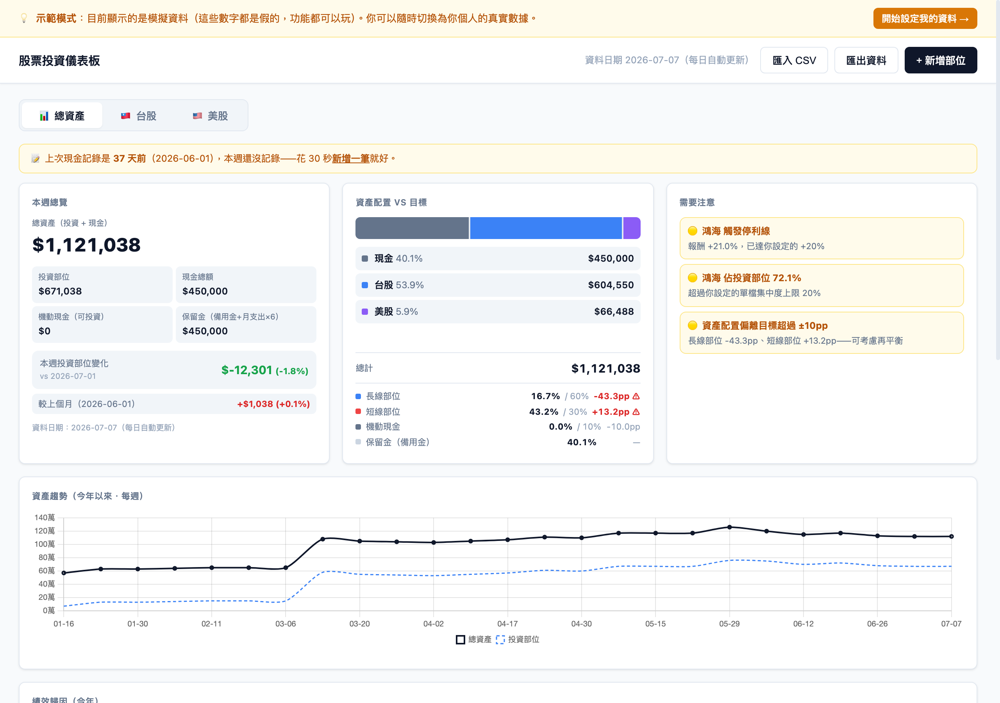
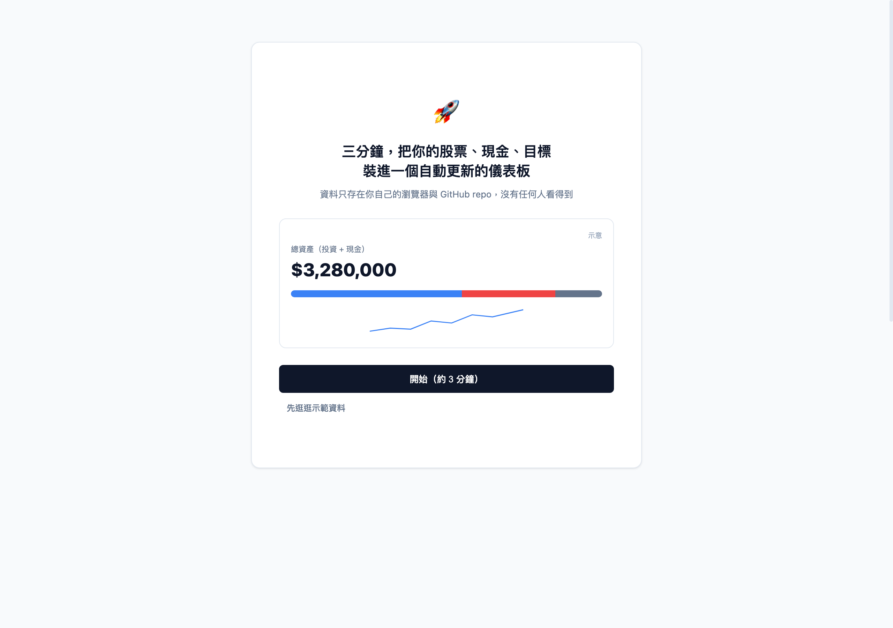
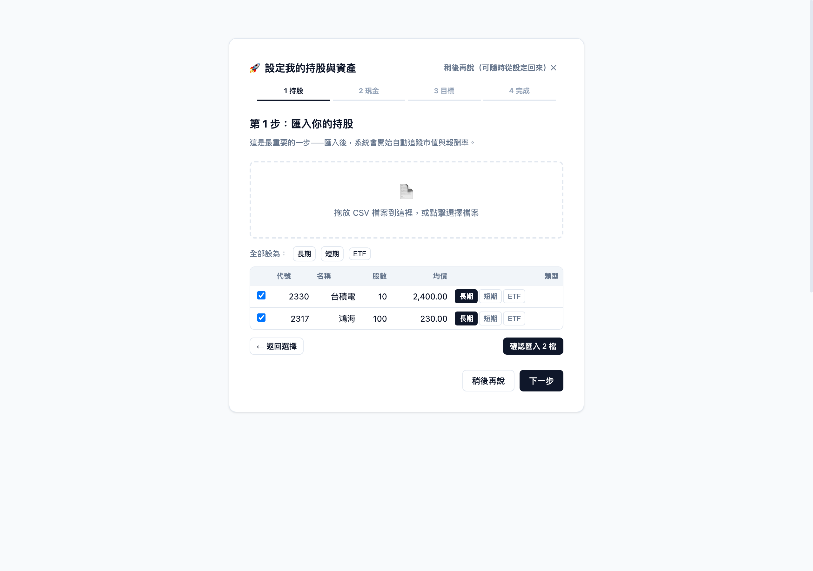
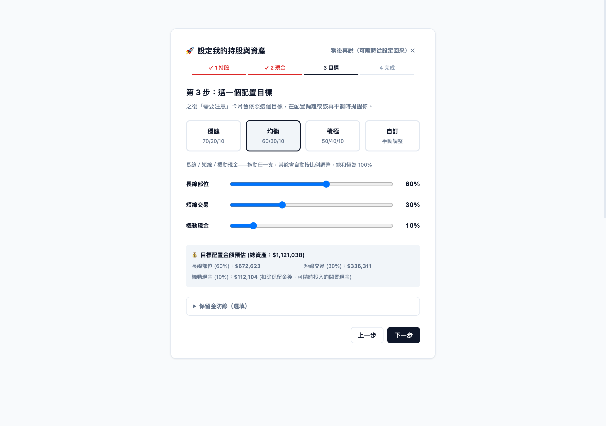
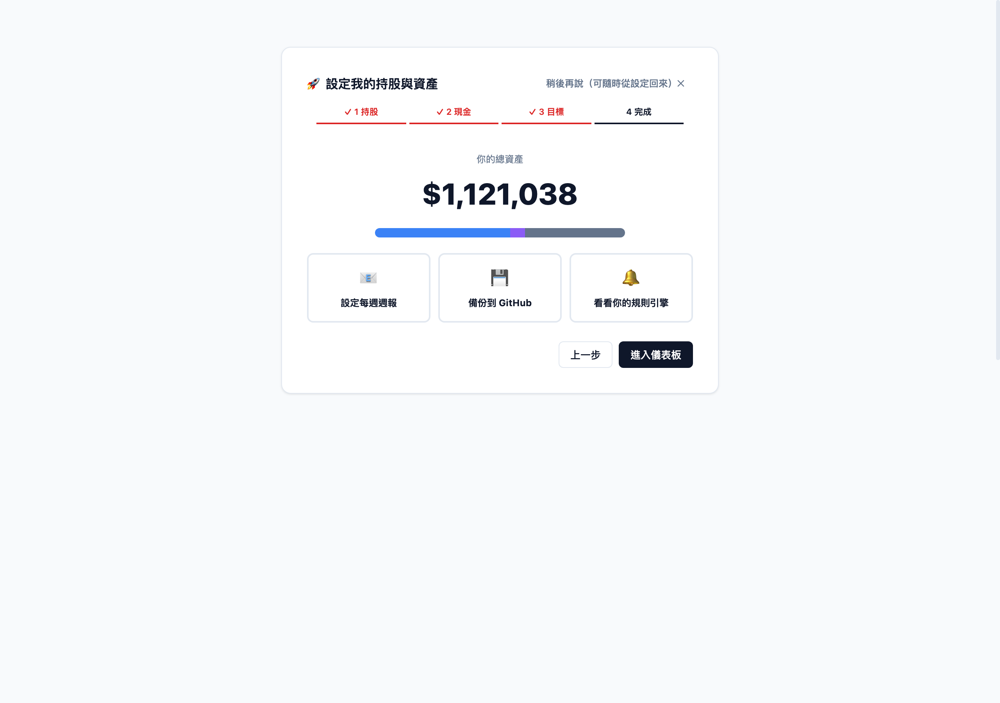

# 個人投資儀表板（範本）

一個**自己部署、資料自己掌握**的個人股票資產儀表板。台股＋美股持倉、週節奏檢視、
配置偏離與停損停利規則提示、績效歸因、每週 email 週報——全部跑在你自己的
GitHub repo 與 Vercel 上，資料只存在你自己手裡。

> 這是一個範本（template）。點 GitHub 上的「**Use this template**」建立**你自己的** repo，
> 就擁有一份獨立的儀表板：自己的資料、自己的每日自動更新、自己的密碼。

## 特色

- **零手動更新**：GitHub Actions 每日收盤後自動抓價、存快照（TWSE／TPEX／Yahoo Finance）
- **純靜態、零後端**：網頁只讀自己 repo 的 `data/*.json`，沒有伺服器、沒有資料庫
- **資料即備份**：所有持股、交易、現金都是 repo 裡的 JSON，天生有版本控制
- **週節奏設計**：預設一週看一次；有觸發你設定的規則才需要行動
- **每週 email 週報**（選配）：本週摘要、需要注意、績效歸因、待辦
- **可加密碼**：Vercel Edge Middleware（Basic Auth），未設定密碼時預設擋下（fail-closed）

## 畫面截圖（示範資料）

主畫面：

首次啟動的設定精靈——匯入 CSV、記現金、選配置目標、看總資產：

<table>
<tr>
<td></td>
<td></td>
</tr>
<tr>
<td></td>
<td></td>
</tr>
</table>

## 快速開始

1. 點 **Use this template** → 建立你自己的 **private** repo（務必 private，裡面是你的財務資料）
2. 到 Vercel 匯入該 repo、設定登入密碼環境變數
3.（選配）設定 Resend API 寄送週報
4. 匯入你的券商 CSV 或手動新增部位

完整步驟見 **[docs/SETUP.md](docs/SETUP.md)**。

## 這是什麼、不是什麼

- ✅ 個人記帳與資產視覺化工具；所有指標皆為數據呈現與你自訂規則的觸發通知
- ❌ **不是**投資建議。價格取自公開 API，正確性不保證。投資決策與風險由你自己承擔。

## 授權

MIT License。
