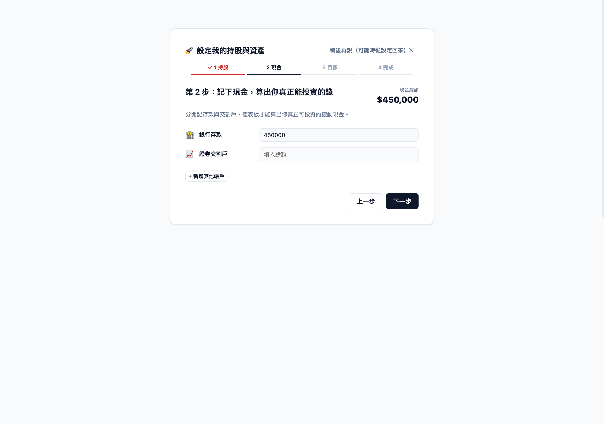

# 部署說明

從零開始，跟著下面步驟走，大約 30 分鐘可以有自己的一份儀表板在線上跑。

## 概念

這個範本是「fork-and-own」模式：你複製一份到自己的 GitHub 帳號，之後：
- **資料**存在你自己 repo 的 `data/` 資料夾（JSON 檔）
- **每日抓價**由你自己 repo 的 GitHub Actions 執行
- **網頁**部署在你自己的 Vercel，可設密碼

範本附帶一份**示範資料**（`data/` 裡標記 `demo:true`），部署後立刻能看到畫面長這樣：


匯入自己的資料後，示範橫幅會消失。

## 步驟

### 1. 建立自己的 repo

GitHub 上點「**Use this template**」→「Create a new repository」→
**務必選 Private**（裡面是你的財務資料）。

> ⚠️ 不要用「Fork」——這個範本本身乾淨，但養成 fork 私人專案的習慣容易在別的地方出事。
> 用「Use this template」建立的 repo 沒有繼承任何歷史，從你自己的第一個 commit 開始。

### 2. 啟用 GitHub Actions

新 repo 的 Actions 預設停用 → 進 repo 的 **Actions** 分頁 → 按啟用。
（每日台北 14:30／08:00 自動抓價；也可在 Actions 頁手動觸發「Daily price fetch」測試，
跑完看到綠勾就表示抓價正常。）

### 3. 部署到 Vercel 並設密碼

1. [vercel.com](https://vercel.com) 免費帳號 → **Import** 你的 repo → Deploy
2. 專案 **Settings → Environment Variables** 新增：
   - `BASIC_AUTH_USER`：你要的帳號
   - `BASIC_AUTH_PASS`：你要的密碼
3. 重新部署一次（Environment Variables 改了要 redeploy 才會生效）。
   ⚠️ **未設定這兩個變數前，網站會一律回 401**（安全預設，避免忘記設密碼卻公開）。

### 4.（選配）每週 email 週報

1. [resend.com](https://resend.com) 免費帳號 → 建立 API Key
2. repo **Settings → Secrets and variables → Actions** 新增 secret `RESEND_API_KEY`
3. 編輯 `data/settings.json` 的 `report.email` 為你的收件信箱
   （或用下面的 `scripts/setup.mjs` 互動式填寫）

### 5. 匯入自己的資料

打開你的網站，會看到設定精靈：Step 1 匯入持股 → Step 2 現金帳戶 → Step 3 選配置目標 → Step 4 看到總資產。

| Step 1：匯入持股 | Step 2：現金帳戶 | Step 3：選配置目標 |
|---|---|---|
|  |  |  |

- 支援國泰證券的「未實現彙總／明細」CSV 直接拖拉匯入；其他券商目前用「手動新增部位」
  （代號／股數／均價三欄，很快）
- 或直接編輯 repo 的 `data/holdings.json`
- 精靈途中隨時可以按「稍後再說」關掉，之後在主畫面的「設定完成」提示卡片點回來繼續
- 想回到示範資料：用 `data.example/` 的檔案覆蓋 `data/`

### 6.（選配）用互動式腳本代替手動編輯 settings.json

不想手動編輯 JSON 的話，本機跑：

```bash
node scripts/setup.mjs
```

會問你收件信箱、目標配置比例、緊急備用金，直接產生 `data/settings.json`。跑完照樣要
`git add . && git commit && git push` 資料才會真的進到 repo。

## 設定檔 `data/settings.json`

| 欄位 | 說明 |
|---|---|
| `targetAllocation` | 長線／短線／機動現金的目標佔比（預設 60/30/10） |
| `allocationDriftAlert` | 配置偏離目標幾個百分點時提示（預設 10） |
| `concentrationAlert` | 單一個股佔投資部位超過幾 % 時提示（預設 20） |
| `swingRules` | 短線停損／停利／移動停利／時間停損規則 |
| `reserve` | 緊急備用金、月支出倍數（用於區分保留金與機動現金） |
| `report.email` | 週報收件信箱 |
| `report.dashboardUrl` | 你的 Vercel 網址（顯示在週報頁尾，選填） |
| `report.brokerMonitorRaw` / `brokerMonitorUrl` | 券商分點監控整合（進階選配，留空即停用該功能） |

## FAQ

**部署後打開網站是空白或錯誤？**
先看 Vercel 的 Deployment 頁面有沒有 build 失敗；其次確認 `BASIC_AUTH_USER`／`BASIC_AUTH_PASS`
兩個環境變數都設了且重新部署過（沒設會直接 401，這是預期行為，不是壞掉）。

**忘記自己設的密碼怎麼辦？**
Vercel 專案 Settings → Environment Variables 改掉 `BASIC_AUTH_PASS`，重新部署即可，不影響資料。

**Daily price fetch 這個 Action 一直失敗？**
到 repo 的 Actions 分頁點進失敗的那次執行看 log；常見原因是股票代號打錯（`data/holdings.json`
裡的 `stockCode` 對不到任何交易所），或當天來源網站臨時抽風——多層 fallback（TWSE/TPEX/Yahoo）
下重跑一次通常就好。

**我的券商不是國泰，CSV 匯不進去？**
目前只解析國泰證券的匯出格式。用「手動新增部位」（代號／股數／均價）一樣能建立持股，
之後 Actions 一樣會每天自動抓價更新市值。

**可以多人一起用同一個網站嗎？**
不建議、也不支援。這個範本是單人 fail-closed 設計，沒有帳號系統與資料隔離；
每個人各自「Use this template」開一份自己的最單純安全。

**我改壞了 `data/*.json`，網頁整個壞掉？**
`data/` 全部有 git 版控，`git log -- data/` 找回上一版，或直接用 `data.example/` 的內容覆蓋
對應檔案重新開始。

**要怎麼確認我的資料真的沒有外流？**
整個架構沒有後端伺服器，網頁只讀你自己 repo 的 `data/*.json`；只要 repo 保持 **Private**
且 Vercel 密碼有設，資料只有你自己看得到（見 [SECURITY.md](../SECURITY.md)）。

## 安全提醒

見 [SECURITY.md](../SECURITY.md)。重點：repo 必須 private、Vercel 密碼必須設定，
資料永遠只在你自己的 repo。
